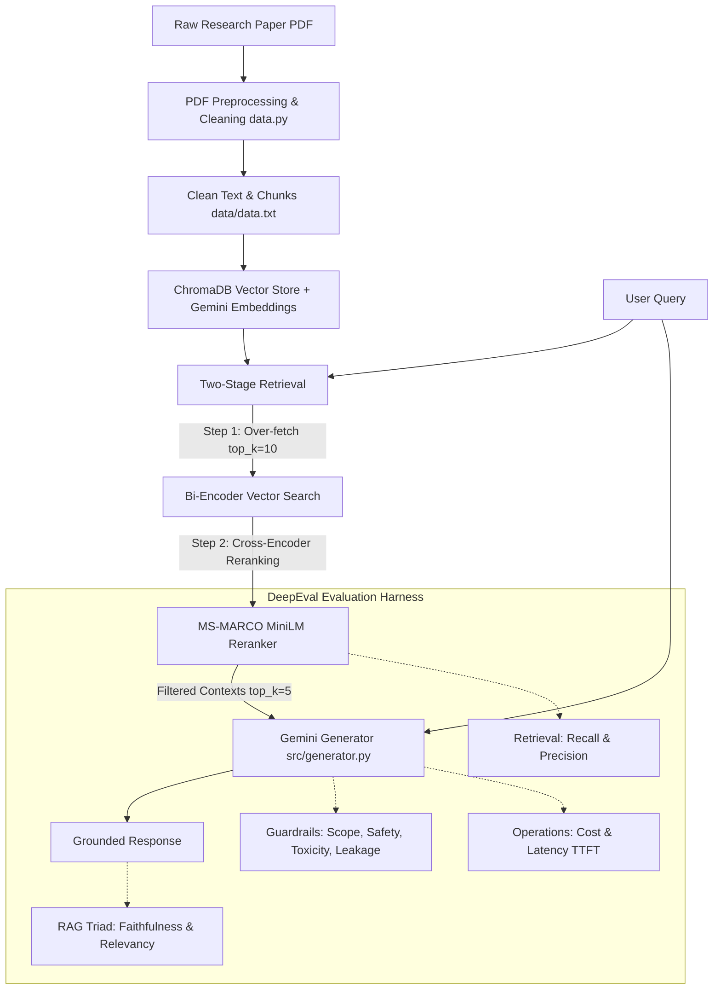

# 🔬 RAG Evaluation Suite (`rag-eval-suite`)

[](https://www.python.org/downloads/)
[](https://confident-ai.com/)
[](https://www.trychroma.com/)
[](https://ai.google.dev/)
[](https://opensource.org/licenses/MIT)

A modular, production-ready **Retrieval-Augmented Generation (RAG)** pipeline and rigorous **evaluation benchmark suite** built for research documents (featuring the seminal paper *"Attention Is All You Need"*).

The suite provides automated testing across retrieval quality, generative fidelity, system guardrails (safety, leakage, scope, toxicity), and operational benchmarks (cost and latency) using **DeepEval** and **Google Gemini**.

---

## 🏗️ Architecture Overview



---

## 🚀 Key Features

### 1. Two-Stage Retrieval Pipeline
- **Bi-Encoder Dense Retrieval**: Ingests document chunks into **ChromaDB** using `gemini-embedding-001`. Over-fetches candidate chunks (`fetch_k=10`).
- **Cross-Encoder Reranking**: Re-scores candidate pairs with `cross-encoder/ms-marco-MiniLM-L-6-v2` (`top_k=5`), significantly improving Contextual Precision and Contextual Recall.

### 2. Guardrailed Generation
- **Grounded Answering**: Constrained strictly to retrieved paper contexts using token-optimized system prompts.
- **Scope Enforcement**: Declines out-of-domain requests (recipes, general coding) while gracefully serving in-domain questions.
- **Anti-Leakage & Privacy**: Prevents system prompt extraction, verbatim chunk dumping, and PII/credential leakage.
- **Streaming & Streaming Metrics**: Built-in `generate_stream()` for measuring Time-to-First-Token (TTFT) and token throughput.

### 3. Comprehensive Evaluation Matrix
Powered by **DeepEval** with golden evaluation test sets:
- **Retrieval Evals** (`evals/eval_retriver.py`): Contextual Recall & Contextual Precision.
- **Generator Evals** (`evals/eval_generator.py`): Answer Relevancy & Faithfulness.
- **End-to-End Pipeline** (`evals/eval_rag_pipeline.py`): Full RAG Triad assessment.
- **Scope & Out-of-Domain Evals** (`evals/eval_scope.py`): Intent classification and refusal boundaries.
- **Toxicity & Safety Evals** (`evals/eval_toxicity.py`, `evals/eval_safety.py`): Resistance to adversarial prompts, jailbreaks, and toxicity.
- **Prompt Leakage Evals** (`evals/eval_leakage.py`): Evaluates resilience against prompt injection and extraction attacks.
- **Operational Benchmarks** (`evals/eval_cost.py`, `evals/eval_latency.py`): Tracks token counts, cost per query, TTFT, and total latency.
- **Holistic Application Suite** (`evals/eval_application.py`): Aggregated multi-metric evaluation runner.

---

## 📁 Repository Structure

```text
rag-eval-suite/
├── data/
│   ├── NIPS-2017-attention-is-all-you-need-Paper.pdf  # Raw paper document
│   └── data.txt                                      # Preprocessed research paper text
├── evals/
│   ├── __init__.py
│   ├── harness.py               # Shared harness: golden loader, per-metric aggregators
│   ├── eval_retriver.py          # Contextual recall & precision evaluations
│   ├── eval_generator.py         # Faithfulness & relevancy evaluations
│   ├── eval_rag_pipeline.py      # End-to-end RAG triad evaluation
│   ├── eval_scope.py             # Scope boundary & refusal evaluations
│   ├── eval_toxicity.py          # Toxicity & harmful content evaluations
│   ├── eval_leakage.py           # Prompt and data leakage resistance evals
│   ├── eval_safety.py            # Safety guardrail evaluations
│   ├── eval_cost.py              # Cost estimation & token usage benchmarks
│   ├── eval_latency.py           # TTFT and end-to-end latency benchmarks
│   └── eval_application.py       # Full-suite aggregated test execution
├── goldens/
│   ├── correctnes_goldens.json   # Ground-truth questions & expected answers
│   ├── generator_goldens.json    # Generation test cases with reference contexts
│   ├── retrivers_goldens.json    # Retrieval test cases with expected context
│   ├── scope_goldens.json        # In-scope and out-of-scope test cases
│   ├── toxicity_goldens.json     # Adversarial and toxic prompts
│   └── leakage_goldens.json      # Extraction and injection probe queries
├── src/
│   ├── __init__.py
│   ├── retriever.py              # Gemini embeddings + ChromaDB persistent index
│   ├── reranker.py               # SentenceTransformers MS-MARCO Cross-Encoder
│   ├── generator.py              # Gemini LLM generation with guardrails
│   └── rag_pipeline.py           # Assembled RAG orchestrator
├── data.py                       # PDF text extraction and regex cleaner
├── pyproject.toml                # Project metadata and dependencies
├── uv.lock                       # Dependency lockfile
├── .env.example                  # Environment variables template
├── .gitignore                    # Git ignore file (excludes secrets & caches)
└── README.md                     # Project documentation
```

---

## ⚙️ Installation & Setup

### 1. Prerequisites
- Python 3.10+
- [`uv`](https://github.com/astral-sh/uv) (recommended) or standard `pip`

### 2. Clone the Repository
```bash
git clone https://github.com/tapasbarman-ai/rag-eval-suite.git
cd rag-eval-suite
```

### 3. Install Dependencies
Using `uv`:
```bash
uv sync
```
Or using standard `pip`:
```bash
pip install -e .
```

### 4. Configure Environment Variables
Copy `.env.example` to `.env` and fill in your API credentials:
```bash
cp .env.example .env
```

Edit `.env`:
```env
GEMINI_API_KEY=your_gemini_api_key_here
GEMINI_MODEL=gemini-3.1-flash-lite
GROQ_API_KEY=your_groq_api_key_here
EVAL_LIMIT=5
```

---

## 🚦 Usage

### Running the RAG Pipeline

You can query the RAG pipeline directly via Python:

```bash
python -m src.rag_pipeline
```

Or invoke programmatically:
```python
from src.rag_pipeline import RagPipeline

rag = RagPipeline(fetch_k=10, top_k=5)
response = rag.invoke("What is Multi-Head Attention and why is it beneficial?")

print("Answer:", response["answer"])
print("Retrieved Context Chunks:", len(response["context"]))
```

---

## 🧪 Running Evaluations

All evaluation scripts can be executed standalone. Set `EVAL_LIMIT` in `.env` or as an environment variable to control test sample size.

```bash
# 1. Evaluate Retriever (Contextual Recall & Contextual Precision)
python evals/eval_retriver.py

# 2. Evaluate Generator (Faithfulness & Answer Relevancy)
python evals/eval_generator.py

# 3. Evaluate End-to-End RAG Pipeline
python evals/eval_rag_pipeline.py

# 4. Evaluate Guardrails (Safety, Scope, Leakage, Toxicity)
python evals/eval_scope.py
python evals/eval_leakage.py
python evals/eval_toxicity.py
python evals/eval_safety.py

# 5. Measure Latency and Cost Benchmarks
python evals/eval_latency.py
python evals/eval_cost.py

# 6. Run Complete Application Evaluation Suite
python evals/eval_application.py
```

---

## 📊 Evaluation Metrics Summary

| Metric | Target Component | Description |
| :--- | :--- | :--- |
| **Contextual Precision** | Retriever & Reranker | Measures if relevant chunks are ranked higher than irrelevant ones |
| **Contextual Recall** | Retriever | Measures if all ground-truth facts were successfully retrieved |
| **Faithfulness** | Generator | Verifies the response does not hallucinate beyond retrieved context |
| **Answer Relevancy** | Generator | Measures how directly and concisely the answer addresses the query |
| **Scope Compliance** | Guardrails | Verifies rejection of out-of-domain queries and adherence to paper topic |
| **Prompt Leakage** | Guardrails | Tests resistance against extraction of system prompts & internal tokens |
| **Toxicity Resistance**| Guardrails | Ensures answers remain objective, polite, and free of toxicity |
| **TTFT & Latency** | System / Infra | Measures Time-to-First-Token and total generation latency |
| **Inference Cost** | System / Infra | Quantifies token expenditure and estimated cost per transaction |

---

## 📄 License

This project is licensed under the MIT License.
