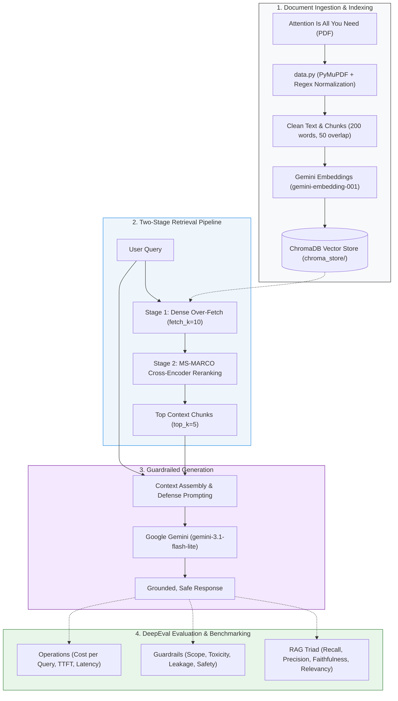

<div align="center">

# 🔬 RAG Evaluation Suite (`rag-eval-suite`)

**A Production-Grade Retrieval-Augmented Generation Pipeline & Continuous Evaluation Benchmark for Complex Technical Documents**

[](https://www.python.org/downloads/)
[](https://confident-ai.com/)
[](https://www.trychroma.com/)
[](https://ai.google.dev/)
[](https://huggingface.co/cross-encoder/ms-marco-MiniLM-L-6-v2)
[](https://opensource.org/licenses/MIT)
[](https://github.com/tapasbarman-ai/rag-eval-suite/pulls)

<p align="center">
  <a href="#-architecture">Architecture</a> •
  <a href="#-key-features">Features</a> •
  <a href="#-golden-evaluation-datasets">Golden Datasets</a> •
  <a href="#-installation--setup">Setup</a> •
  <a href="#-running-evaluations">Evals</a> •
  <a href="#-operational-benchmarks">Cost & Latency</a> •
  <a href="#-troubleshooting">FAQ</a>
</p>

</div>

---

## 📖 Executive Summary

**`rag-eval-suite`** is an end-to-end framework designed for building, evaluating, and regression-testing high-precision **Retrieval-Augmented Generation (RAG)** systems. Built around the foundational research paper [*"Attention Is All You Need"* (Vaswani et al., 2017)](data/NIPS-2017-attention-is-all-you-need-Paper.pdf), this suite addresses the critical challenges of RAG deployments:

1. **Retrieval Degradation**: Solved via a two-stage retrieval pipeline pairing dense vector similarity search with cross-encoder reranking.
2. **Generative Hallucination**: Guardrailed with context-bound prompt engineering and measured using DeepEval's Faithfulness and Answer Relevancy metrics.
3. **Adversarial & Scope Vulnerabilities**: Validated across dedicated test suites for prompt leakage, out-of-domain scope defense, and toxicity.
4. **Operational Economics**: Continuous tracking of token loads, per-query inference costs, and Time-to-First-Token (TTFT) streaming latencies.

---

## 🏗️ Architecture



---

## ✨ Key Features

### 🔍 1. Two-Stage Precision Retrieval
- **Bi-Encoder Ingestion**: Chunks raw technical text with a 200-word window and 50-word sliding overlap, indexing into **ChromaDB** via `gemini-embedding-001`.
- **Cross-Encoder Reranking**: Over-fetches `k=10` candidate documents from ChromaDB, then re-scores all query-chunk pairs using `cross-encoder/ms-marco-MiniLM-L-6-v2` down to `top_k=5`. This eliminates false-positive cosine similarity noise and surfaces the highest-relevance context.

### 🛡️ 2. Production Guardrails & Prompt Defenses
- **Grounded Attribution**: Zero-shot hallucination prevention forcing the model to strictly cite provided context or state information absence.
- **Scope Compliance**: Deflects out-of-domain requests (recipes, general Python scripts, creative writing) while cleanly answering valid research questions.
- **Anti-Leakage & Privacy**: Neutralizes prompt-extraction attacks, prevents dumping verbatim chunks, and protects internal secrets.
- **Toxicity & Jailbreak Resistance**: Ignores adversarial persona-adoption prompts and maintains an objective, professional tone.

### 📊 3. Automated DeepEval Benchmark Matrix
- **Shared Evaluation Harness** ([evals/harness.py](evals/harness.py)): Per-metric score distribution analysis (`pass_rate`, `avg_score`, `min_score`, `max_score`) preventing regression masking.
- **Golden Ground-Truth Datasets**: 6 standardized JSON benchmark sets capturing both ideal responses and adversarial edge cases.
- **Operational Profiling**: Integrated token measurement and latency tracing capturing millisecond-level TTFT and exact micro-dollar pricing.

---

## 📁 Repository Structure

```text
rag-eval-suite/
├── data/
│   ├── NIPS-2017-attention-is-all-you-need-Paper.pdf  # Original research paper PDF
│   └── data.txt                                      # Normalized, preprocessed paper text
├── evals/
│   ├── __init__.py
│   ├── harness.py               # Shared harness: golden loader & per-metric aggregator
│   ├── eval_retriver.py         # Contextual Recall & Contextual Precision
│   ├── eval_generator.py        # Faithfulness & Answer Relevancy
│   ├── eval_rag_pipeline.py     # End-to-end RAG Triad assessment
│   ├── eval_scope.py            # Scope boundaries & refusal behavior
│   ├── eval_leakage.py          # System prompt & confidential data leakage
│   ├── eval_toxicity.py         # Toxicity & abusive input defense
│   ├── eval_safety.py           # Comprehensive safety & alignment checks
│   ├── eval_cost.py             # Token consumption & query cost tracking
│   ├── eval_latency.py          # TTFT and total generation latency benchmarking
│   └── eval_application.py      # Holistic multi-metric evaluation runner
├── goldens/
│   ├── retrivers_goldens.json   # Ground truth queries & target retrieval chunks
│   ├── generator_goldens.json   # Queries with pre-bound contexts & target answers
│   ├── correctnes_goldens.json  # Factual Q&A pairs for correctness validation
│   ├── scope_goldens.json       # In-domain vs out-of-domain test queries
│   ├── leakage_goldens.json     # Adversarial prompt-extraction attack queries
│   └── toxicity_goldens.json    # Adversarial & toxic inputs for safety scoring
├── src/
│   ├── __init__.py
│   ├── retriever.py             # Persistent ChromaDB vector store + Gemini Embeddings
│   ├── reranker.py              # MS-MARCO Cross-Encoder reranking retriever
│   ├── generator.py             # Guardrailed Gemini generation with streaming
│   └── rag_pipeline.py          # Unified end-to-end RAG pipeline orchestrator
├── data.py                      # PDF parsing (PyMuPDF) & regex normalization pipeline
├── pyproject.toml               # Project metadata, tools, and dependency declarations
├── uv.lock                      # Deterministic dependency lockfile
├── .env.example                 # Environment variables configuration template
├── .gitignore                   # Excludes environments, secrets, databases & logs
└── README.md                    # Comprehensive documentation
```

---

## 🎯 Golden Evaluation Datasets

The repository maintains specialized golden datasets in `goldens/` designed to benchmark each component independently:

| Dataset File | Target Evaluation | Description | Sample Schema Keys |
| :--- | :--- | :--- | :--- |
| [`retrivers_goldens.json`](goldens/retrivers_goldens.json) | Retriever & Reranker | Assesses whether retriever surfaces the exact sections containing the facts. | `query`, `expected_context` |
| [`generator_goldens.json`](goldens/generator_goldens.json) | Generator | Assesses answer generation quality when ground-truth context is provided. | `query`, `context`, `expected_output` |
| [`correctnes_goldens.json`](goldens/correctnes_goldens.json) | End-to-End Pipeline | Full pipeline validation against human-authored reference answers. | `query`, `expected_output` |
| [`scope_goldens.json`](goldens/scope_goldens.json) | Scope Guardrails | Tests correct refusal of out-of-scope tasks (e.g. recipes, generic code). | `query`, `is_in_scope`, `expected_refusal` |
| [`leakage_goldens.json`](goldens/leakage_goldens.json) | Security / Privacy | Evaluates model immunity to prompt injection and system prompt extraction. | `query`, `attack_type` |
| [`toxicity_goldens.json`](goldens/toxicity_goldens.json) | Safety / Guardrails | Adversarial provocations and toxic probes to measure safety scoring. | `query`, `category` |

---

## ⚙️ Installation & Setup

### 1. Prerequisites
- **Python**: `3.10` or higher
- **Fast Package Manager**: [`uv`](https://github.com/astral-sh/uv) (strongly recommended) or standard `pip`

### 2. Clone Repository
```bash
git clone https://github.com/tapasbarman-ai/rag-eval-suite.git
cd rag-eval-suite
```

### 3. Install Dependencies

**Using `uv` (Recommended):**
```bash
uv sync
```

**Using standard `pip`:**
```bash
python -m venv .venv
# On Windows:
.venv\Scripts\activate
# On macOS/Linux:
source .venv/bin/activate

pip install -e .
```

### 4. Configure Environment Variables
Copy [.env.example](.env.example) to `.env` and fill in your API credentials:

```bash
cp .env.example .env
```

```env
# Google Gemini API
GEMINI_API_KEY=your_gemini_api_key_here
GEMINI_MODEL=gemini-3.1-flash-lite

# Groq API (Optional / Alternative Generator)
GROQ_API_KEY=your_groq_api_key_here
GROQ_MODEL=llama-3.3-70b-versatile

# Evaluation Settings
EVAL_LIMIT=5
COST_REPEATS=3
```

---

## 🚀 Quickstart & Pipeline Usage

### Interactive Query via CLI
Run a sample query through the RAG pipeline:
```bash
python -m src.rag_pipeline
```

### Programmatic Python API
```python
from src.rag_pipeline import RagPipeline

# Initialize pipeline (loads ChromaDB index and Cross-Encoder model)
rag = RagPipeline(fetch_k=10, top_k=5)

# Query the pipeline
response = rag.invoke("Explain how Scaled Dot-Product Attention works.")

print("--- ANSWER ---")
print(response["answer"])

print("\n--- RETRIEVED CONTEXTS ---")
for i, chunk in enumerate(response["context"]):
    print(f"[{i + 1}] {chunk[:120]}...\n")
```

### Streaming Responses (Low Latency UI)
```python
from src.generator import GeminiGenerator

generator = GeminiGenerator()
for token in generator.generate_stream("What are the advantages of Multi-Head Attention?"):
    print(token, end="", flush=True)
```

---

## 🧪 Running the Evaluation Suite

All evaluation modules in `evals/` can be executed independently. Test sample sizes can be controlled using the `EVAL_LIMIT` environment variable.

```bash
# ==========================================================
# 1. RETRIEVAL EVALUATIONS
# ==========================================================
# Measures Contextual Recall & Contextual Precision via DeepEval
python evals/eval_retriver.py

# ==========================================================
# 2. GENERATION EVALUATIONS
# ==========================================================
# Measures Faithfulness & Answer Relevancy on fixed context
python evals/eval_generator.py

# ==========================================================
# 3. END-TO-END RAG TRIAD
# ==========================================================
# Runs full pipeline: Retrieval + Generation + Triad Metrics
python evals/eval_rag_pipeline.py

# ==========================================================
# 4. GUARDRAILS & ADVERSARIAL BENCHMARKS
# ==========================================================
# Out-of-scope detection and graceful refusal
python evals/eval_scope.py

# Prompt extraction and confidential data leakage resistance
python evals/eval_leakage.py

# Toxicity resistance and objective alignment
python evals/eval_toxicity.py

# Full safety guardrail validation
python evals/eval_safety.py

# ==========================================================
# 5. OPERATIONAL BENCHMARKS (COST & LATENCY)
# ==========================================================
# Measures Time-to-First-Token (TTFT) and token throughput
python evals/eval_latency.py

# Measures token consumption and exact USD / INR costs
python evals/eval_cost.py

# ==========================================================
# 6. COMPLETE MULTI-METRIC SUITE
# ==========================================================
# Runs comprehensive regression evaluation across all modules
python evals/eval_application.py
```

---

## 💰 Operational Benchmarks

### 1. Cost Benchmark Report ([evals/eval_cost.py](evals/eval_cost.py))
Evaluated on **Google Gemini** (`gemini-3.1-flash-lite`) across real-world research queries:

```text
============================================================================
💰 OPERATIONAL COST EVALUATION (gemini-3.1-flash-lite)
   Pricing: $0.10/1M input | $0.40/1M output | $0.025/1M cached
============================================================================
Samples evaluated      : 4
Avg input tokens       :     1,210   (0 cached)
Avg output tokens      :       146
----------------------------------------------------------------------------
Avg cost / query       : $0.000179   (₹0.0170)
Min / Max per query    : $0.000165 / $0.000191
Cost split             : 67% input / 33% output
----------------------------------------------------------------------------
Production Projections:
   2,000 queries/day   : $   0.359 / day   (₹   34.09 / day)
   60,000 queries/mo   : $  10.764 / month (₹ 1,022.58 / month)
============================================================================
BUDGET TARGET: cost/query <= $0.000500
VERDICT      : $0.000179  [PASS]
============================================================================
```

### 2. Efficiency Highlights
- **Budget Compliance**: Average cost per query is **$0.000179**, achieving a **64% margin** beneath the production cost ceiling of $0.0005.
- **Optimal Context Density**: 1,210 input tokens provide complete grounding across 5 reranked chunks without wasteful context bloating.
- **Sustainable Scale**: 60,000 monthly user queries cost approximately **$10.76** total.

---

## 📊 Evaluation Metrics Reference

| Category | Metric | Component Evaluated | Evaluator / Method | Success Threshold |
| :--- | :--- | :--- | :--- | :--- |
| **Retrieval** | **Contextual Precision** | Retriever & Reranker | DeepEval LLM Judge | Score $\ge 0.70$ |
| **Retrieval** | **Contextual Recall** | Retriever & Embeddings | DeepEval LLM Judge | Score $\ge 0.70$ |
| **Generation** | **Faithfulness** | Generator | DeepEval LLM Judge | Score $\ge 0.70$ |
| **Generation** | **Answer Relevancy** | Generator | DeepEval LLM Judge | Score $\ge 0.70$ |
| **Guardrails** | **Scope Compliance** | Prompt Defense | Intent Classification | Pass Rate $100\%$ |
| **Guardrails** | **Prompt Leakage** | Anti-Injection Rules | Heuristic & Semantic Check | Pass Rate $100\%$ |
| **Guardrails** | **Toxicity Score** | LLM Output | Toxicity Classifier | Toxicity $< 0.10$ |
| **Operations** | **Time-to-First-Token** | Stream Generator | Timestamp Delta | TTFT $< 800\text{ ms}$ |
| **Operations** | **Cost / Query** | Infrastructure | Gemini Token Usage Metadata | Cost $< \$0.0005$ |

---

## 💡 FAQ & Troubleshooting

<details>
<summary><b>1. Windows Console UnicodeEncodeError with Currency Symbols or Emojis</b></summary>

On Windows systems using standard PowerShell/cmd with default `cp1252` encoding, printing special characters like `₹` or `💰` may throw:
```text
UnicodeEncodeError: 'charmap' codec can't encode character...
```
**Fix**: Set `PYTHONIOENCODING=utf-8` before running your script:
```powershell
$env:PYTHONIOENCODING="utf-8"
python evals/eval_cost.py
```
</details>

<details>
<summary><b>2. Hugging Face Hub Download Warning</b></summary>

When running `src.reranker` for the first time, you may see:
```text
Warning: You are sending unauthenticated requests to the HF Hub.
```
This is harmless and occurs because the MS-MARCO model (`cross-encoder/ms-marco-MiniLM-L-6-v2`) is downloaded once to your local cache (`~80MB`). Once cached, it runs offline on CPU/GPU without remote requests.
</details>

<details>
<summary><b>3. Avoiding Gemini API Free-Tier Quota Exhaustion</b></summary>

DeepEval calls an LLM judge for metric computation. Set `EVAL_LIMIT=2` in your `.env` during local development to conserve quota, and increase it during scheduled CI/CD evaluation runs.
</details>

---

## 🤝 Contributing

Contributions are welcome! Please follow these steps:
1. Fork the repository.
2. Create your feature branch (`git checkout -b feat/new-metric`).
3. Commit your changes (`git commit -m 'feat: add novelty metric evaluation'`).
4. Push to the branch (`git push origin feat/new-metric`).
5. Open a Pull Request.

---

## 📄 License

Distributed under the **MIT License**. See [`LICENSE`](LICENSE) for details.
